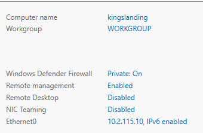
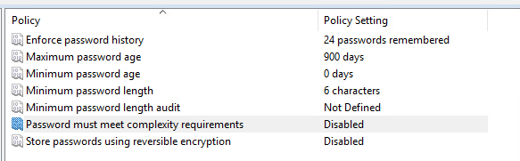

# dc01


first, u need to setup Windows Server 2019 with this parameters

"hostname" : "kingslanding",
 "local_admin_password": "8dCT-DJjgScp",
 "domain" : "sevenkingdoms.local",
"netbios_name": "SEVENKINGDOMS"

next u need to enable RDP on this server via "local server"



next change password policy (check image)



next, run ps scripts in this order
```
UsersCreate.ps1

# then u should check that all users are enabled

ACL.ps1
laps.ps1 
```
u can check installation with this commands:
```
net localgroup "Remote Desktop Users"
net localgroup "Administrators"
```

after this u need to install essos.local (dc03), install the bidirect trust and run this script on dc01
```
sidhistory.ps1
!! add "essos.local\\daenerys.targaryen" to the AcrossTheNarrowSea

```


